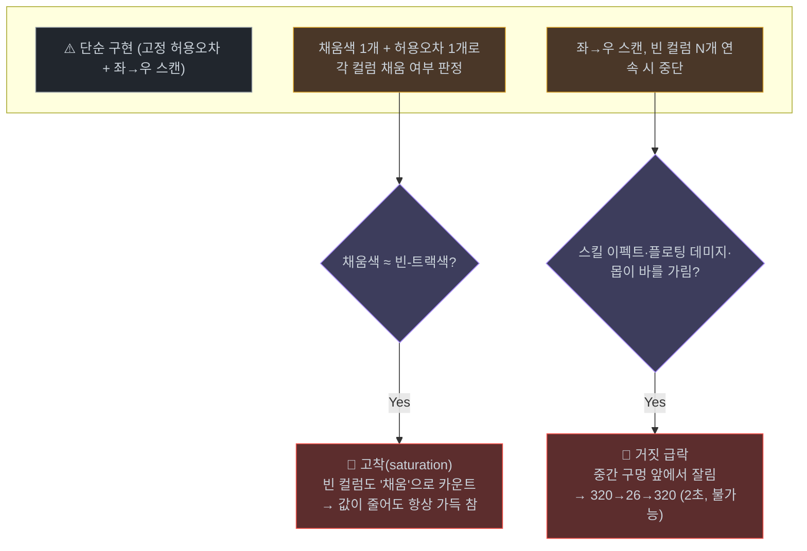
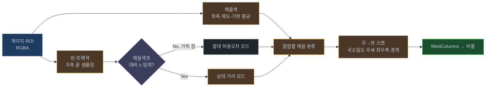

# 게이지/진행바 픽셀 측정 — 고착·가림에 견고한 기법

> 화면의 HP/MP 게이지·로딩바·진행바를 **OCR 없이 픽셀로** 정확히 측정하는 재사용 패턴.
> 출처: Lineage MP Timer v3.0.1 (`src/core/ocr/bar-fill.ts`) — 실기 로그에서 드러난 두 실패 모드를 근본 수정.

---

## 1. 왜 픽셀 측정인가

게이지는 "현재값/최대값" 텍스트를 함께 표시하지만, 작은 폰트의 OCR은 `0↔8`, `6↔8` 같은 오인식이 잦다. 반면 **게이지가 채워진 컬럼 수**는 비율을 직접 주므로 글자 혼동이 원천적으로 없다.

```
cur = round(maxValue × filledColumns / calibratedFullColumns)
```

100% 상태에서 1회 보정(채움색 + full 컬럼 수)하면 이후 OCR 불필요. **단, 단순 구현은 두 가지 실전 함정에 빠진다.**

---

## 2. 두 가지 실패 모드 (실기에서 관측)



### 2.1 고착(saturation)
채움색이 무채색에 가까운 색(예: 갈색 `rgb(110,91,80)`)이고 **빈 게이지 트랙도 비슷한 색**이면, 고정 허용오차(예: 유클리드 70) 하나로는 둘을 구분 못 한다. 빈 컬럼까지 "채움"으로 세어 **값이 줄어도 항상 가득 참**으로 측정된다.

> 결정적 증거: 보정 *전* 자동 채도-기반 색은 310을 읽다가, 보정 *후* 과포용 색(갈색)을 잡자 320에 고착 → **보정이 오히려 악화**.

### 2.2 순간 가림 → 거짓 급락
좌→우로 스캔하다 "빈 컬럼 N개 연속 → 중단" 방식은, 스킬 이펙트/플로팅 데미지/몬스터가 바 **중간**을 가리면 그 구멍 앞에서 잘려 거짓 near-empty를 낸다. `값 → 급락 → 원복`이 자연회복 속도로 불가능한 시간(2초)에 일어나면 오인식 확정.

---

## 3. 견고한 알고리즘



### 3.1 빈-트랙색 상대 분류 (고착 방지)
바 **우측 끝(~8%)**을 샘플링해 빈-트랙색을 추정한다. 값이 100% 미만이면 그 영역은 항상 빈 트랙이다.

- 트랙색과 채움색의 대비가 임계(유클리드 18) **미만**이면 → "지금 가득 참(빈 샘플 없음)"으로 보고 **절대 허용오차** 폴백(가득 참 정상 측정).
- 대비가 충분하면 → 각 픽셀을 **상대 거리**로 분류: `dist(픽셀, 채움) < dist(픽셀, 트랙)` 이고 절대 상한 이내일 때만 채움.

> 핵심: 두 색이 비슷해도(예: 거리 59 < 기존 허용오차 70) "어느 쪽에 더 가까운가"로 갈라 고착을 막는다. 어떤 색이든 *조금이라도* 구분되면 동작.

### 3.2 우→좌 국소밀도 경계 (가림 방지)
경계를 **오른쪽에서부터** 찾는다: "채움이면서, 좌측 작은 윈도우 내 채움 비율 ≥ 50%"인 **최우측 컬럼**.

```
win = max(3, round(width × 0.04))
for x = width-1 → 0:
    if !colFilled[x]: continue
    localDensity = (윈도우 [x-win+1 .. x] 내 채움 수) / 윈도우 크기
    if localDensity ≥ 0.5: boundary = x; break
filledColumns = boundary + 1
```

- 내부 가림 구멍은 그 **오른쪽에 진짜 채움**이 있으므로 무시된다(거짓 급락 차단).
- 우측의 고립된 노이즈 컬럼 1~2개는 국소밀도가 0.5 미만이라 걸러진다(거짓 inflate 차단).
- 윈도우 백-룩 방식이라 경계 위치에 +바이어스가 없다(정확).

---

## 4. 시간 추적기와의 결합 (선택)

픽셀 측정 위에 **베이지안 시간 추적기**(`posterior = √(prior × temporal × rate) × conf`)를 두어 단발 오인식을 거부한다. 단, **변화가 빠른 값**(전투 중 MP)은 anomaly 승격 기준을 낮춰(예: 5→3회 일관) 표시가 실제를 빨리 따라가게 한다. 픽셀 소스가 고신뢰(0.95)일 때 유효.

---

## 5. 테스트 전략 (게임 없이)

`RgbaImage`(캔버스/DOM/Node 무관 순수 버퍼)로 합성 바를 만들어 단위 테스트:

| 케이스 | 기대 |
|--------|------|
| 트랙색 ≈ 채움색(갈색/짙은갈색) 절반 | 비율 ~0.5 (고착 아님) |
| 다단계(0.2/0.5/0.8) 추적 | 오차 < 0.06 |
| 가득 찬 바 + 내부 흰색 가림 | 여전히 ~1.0 |
| 절반 바 + 채움 위 가림 | ~0.5 (구멍 무시) |
| 빈 바 + 우측 2px 노이즈 | < 10컬럼 |

> 실패 모드를 *재현하는* 합성 픽셀이 알고리즘의 회귀를 막는 가장 강한 근거. 138개 테스트로 검증.

---

## 6. 적용 체크리스트

1. 채움색은 **채도/밝기 기반**으로 좌측에서 잡되, 보정이 과포용 색을 잡지 않게 주의.
2. 빈-트랙색은 **런타임 우측 샘플링** + 대비 임계 폴백.
3. 컬럼 분류는 **상대 거리**(트랙 추정 가능 시), 아니면 절대.
4. 경계는 **우→좌 국소밀도**(가림·노이즈 견고).
5. 변화 빠른 값은 추적기 anomaly 기준 완화.
